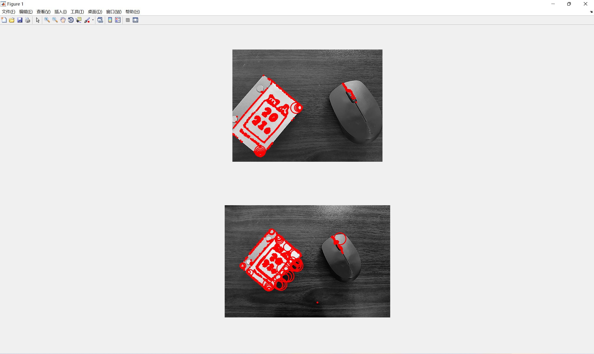
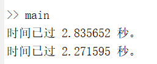
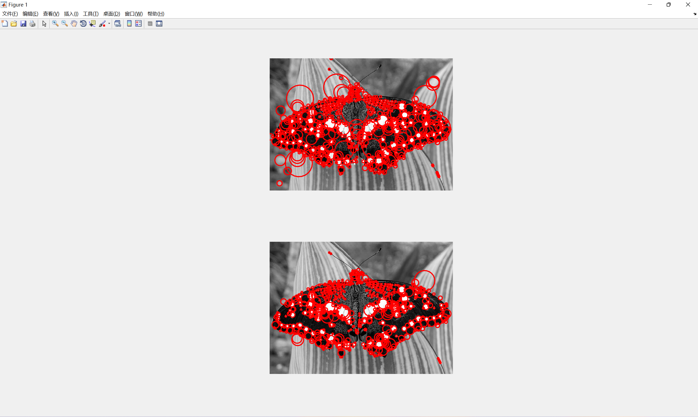
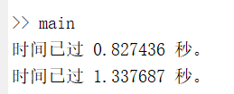

# Programming 1

**1951095   Yiwen Liang**

Get two images, taken from the same scene but with scale transformations. Detect the scale invariant points on the two images. You can use the center of the circle to indicate the spatial position of the point and use the radius of the circle to indicate the characteristic scale of the point.

### Brief

In this homework, I detect the interest points and characteristic scales by applying a Laplacian of Gaussian(LoG) filter at a variety of scales. Input two images of different scale, and their feature points and feature scales are marked on the final output images.

### File structure

- picture - You picture file(*.jpg, *.png, *.bmp)
- code - the source code
  - main.m - Main program(program entry). You can run it directly, and input your images name in `img1Name` and `img2Name`
  - detect_point_scale.m -  A core function that increases the size of the filter to detect blobs at different sizes.
  - implement_draw.m - Mark the position of interest points and its characteristic scale in the image

### Software version

MATLAB R2016a

### Running operation 

Enter `./code` directory, and run `main.m` directly. Notice that for running successfully, your MATLAB workspace path must be **"xxxx\code"**

### Result

