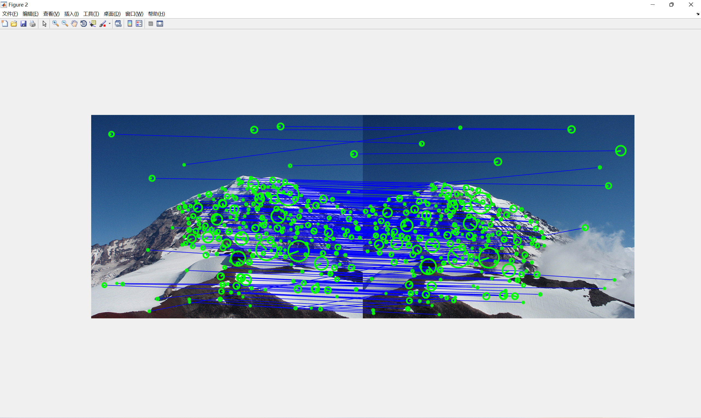
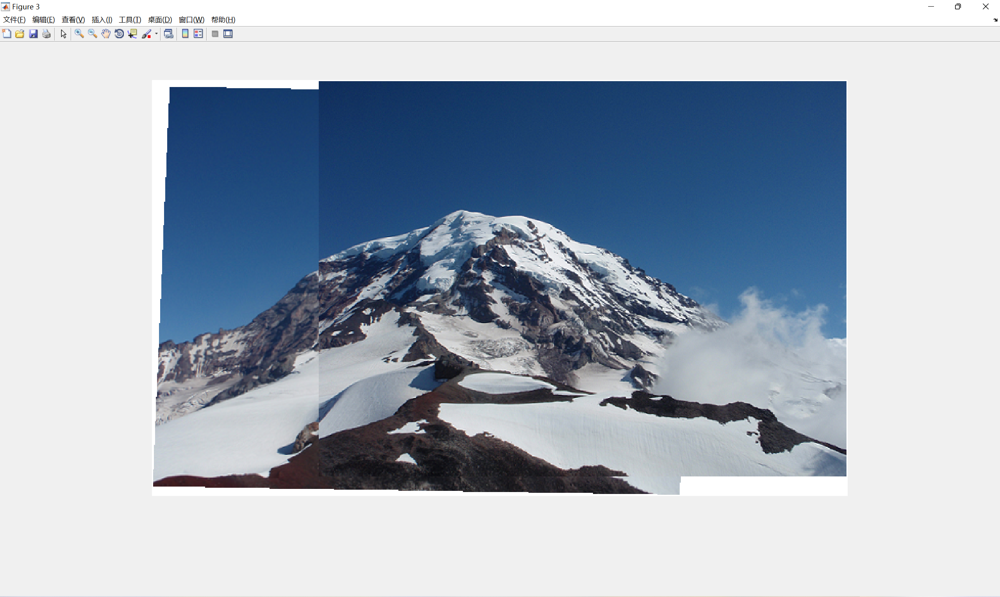
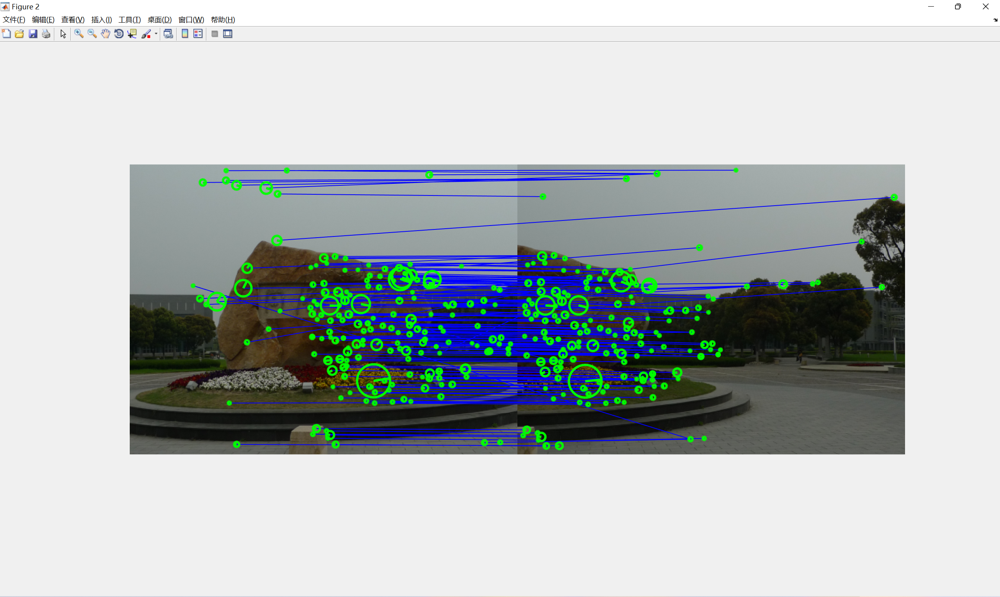
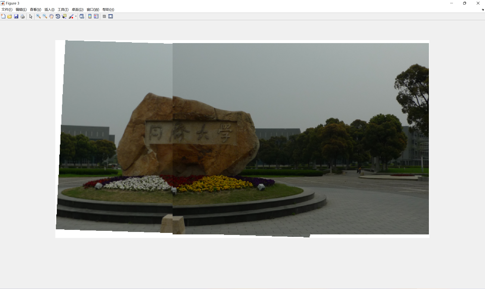
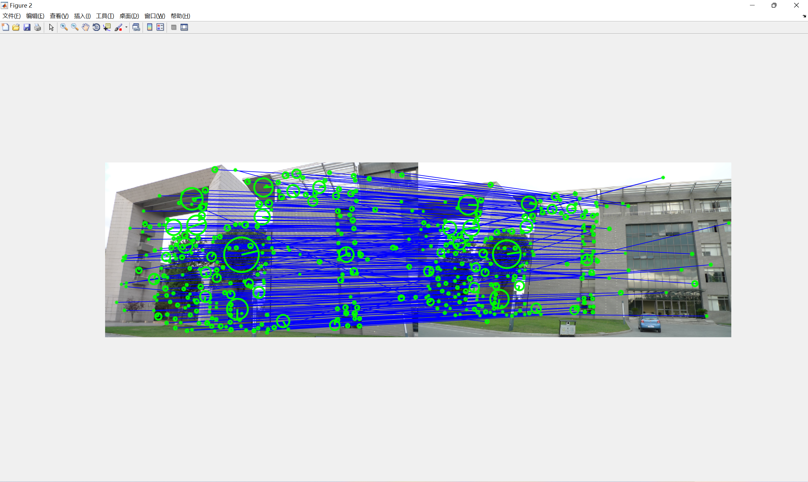
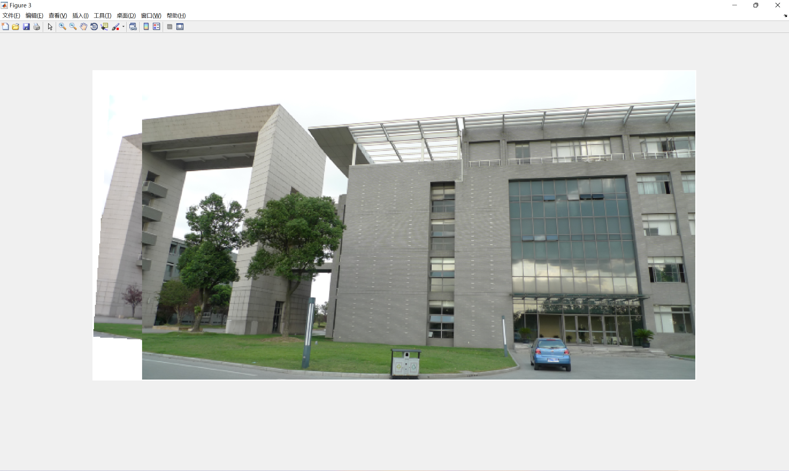

# Programming 2

**1951095   Yiwen Liang**

Get two images *I*1 and *I*2 of our campus and make sure that the major parts of *I*1 and *I*2 are from the same physical plane. Stitch *I*1 and *I*2 together to get a panorama view using scale-normalized LoG (or DoG) based interest point detector and SIFT descriptor. You can use OpenCV or VLFeat.


### Brief

In this homework, I extract SIFT descriptor for each keypoint in an image using **VLFeat** in **MATLAB**, and use the traversal method to find one - to - one matching relation between the SIFT descriptors. Then I apply least-square method to find the affine transformation matrix, with RANSAC to fit a model(transformation) to a data set which contains outliers. Finally, I use the transformation matrix to transform image 1, then stitch it with image 2 and image 1 is on the top. The final result is three images. **Figure 1** represents two different images; **figure 2** is an image representing their matching status; **figure 3** is the stitching panorama.

### File structure

- *picture* - You picture file(*.jpg, *.png, *.*bmp)
- *code* - the source code
  - *main.m* - Main program(program entry). You can run it directly, and input your images name in `img1_dir` and `img2_dir`
  -  *SIFTMatching.m* - A function implements SIFT descriptor matching, with the traversal matching method.
  -  *RANSAC.m* - A function for robust fit a model to a data set S which contains outliers, searching for the transformation matrix.
  -  *ComputeError.m* - A function for compute the error in RANSAC when using transformation matrix Affine to transform the matched points.
  -  *imgStitch.m* - A function for stitching the images.

### Software version

MATLAB R2016a

### Running operation 

If you don't have VLFeat, you can execute the command in your MATLAB Command window:

```matlab
% Input the path of VLFeat
run('..../vlfeat-0.9.21/toolbox/vl_setup.m');
```

Enter `./code` directory, and run `main.m` directly. Notice that for running successfully, your MATLAB workspace path must be **"xxxx\code"**

### Result












