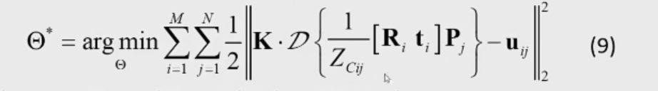
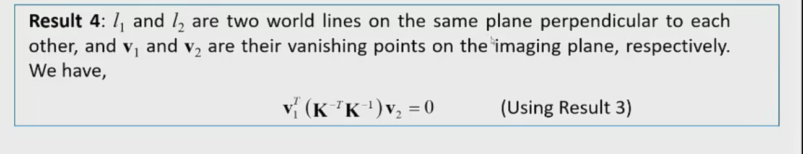

# cv复习

### 全景拼接

1. 前置要求：（1）相机没有畸变  （2）拍的东西是来自同一个物理平面的。 这样才能保证图像平面之间存在映射关系
2. 整体流程：
   - **（1）interest point 检测（特征点检测）**   
   - **（2）局部描述子构建**
   - **（3）建立点对之间映射关系**
   - **（4）根据点对关系，解方程，建立最小二乘法，求单映矩阵，求解。解这个方程用的是RANSAC的框架，可以处理掉一些outliers。**
   - **（5）然后把这个矩阵施加到某一张图像上，完成拼接**

3. 上课中提到的人名！！有必要去了解一下这些人物！科普知识需要了解一下

- Harris: 角点检测
- 马文明斯基：绪论
- David mar: 绪论
- David loggy
- 张正友：相机标定

4.  Harris角点检测需要观照这张图象，去了解怎么从输入了一张图像，然后最终产生一个corner（output），即位置。

步骤如下：

（1）求偏导数，I_x  I_y

（2）计算偏导平方项和交叉项

（3）对窗口进行高斯卷积

（4）计算角的长度（经验公式）   如果特征值都很大的话，R会很大

（5）非最大值抑制

5. 尺度不变的特征点检测

熟悉流程！！   图像中找到一些点，不管放大还是缩小都能看到，知道点的尺度信息，LOG   Block特征（斑点特征）

前面要记得乘上一个sigma^2，做normalize

1. 构建LOG的尺度空间，就是去改变LOG的sigma，越来越大
2. 尺度空间里面找特征点。如果某个点在27个点里面是一个极值点，把这个点记下来，这个点叫做尺度空间里面的特征点。把位置和对应的尺度记下来~

### 描述符的构造

Harris不能达到旋转不变性，尺度不变性！ 只是取一个邻域，然后用列向量来表示。Harris假设是特征尺度不变的！

SIFT和尺度不变的特征点是配套的。

SIFT步骤：

（1）找到主方向，达到旋转不变性

（2）区域里面建立128维的描述符，邻域分成4*4=16个方格，每一个方格建立**梯度方向直方图**(是怎么样的？今晚去搜一下！！）。方向分成了8个bin  16 * 8 = 128

熟悉他的流程！！    同时也要熟悉它的输出，包括：

（1）n个128维的描述子

（2）n个点，描述特征尺度多大的

（3）n个方向向量 

（4）n个二维点，指明点的位置

### RANSAC

目标是什么，解决什么问题，怎么来做    流程说明白！！

### 射影几何

两点定一条直线，两条直线定一个点，怎么样求出一条直线。概念清楚！！

直线的线坐标是什么？两条直线，他们交点的坐标是什么？

给定我一条直线，**我怎么去计算它无穷远点的坐标**？

### 非线性最小二乘

阻尼法框架，高斯牛顿，基本概念！！非线性最小二乘   目标函数的形式？

列文伯格  马夸尔特！  梯度信息反映在了雅可比矩阵里面   进行一阶泰勒展开得到！！

走一步看一步！  迈的步子太大，会惩罚！

证明那个，列文伯格马夸尔特矩阵！！

### 相机标定的流程

相机成像模型！！

三位像素的一个坐标点，到最后怎么面呈而为世界上面的一个点的？

5个坐标系之间的关系

镜头的畸变！！  归一化成像平面坐标系上建立的！

用自己的话，去一步步解释公式（8）

世界坐标系，乘上[R,t]，转换到了相机坐标系下看待世界点，除以Z_c--->归一化成像平面上 

D（镜头畸变），作用在归一化成像平面之上的，然后再乘以内参矩阵K，得到像素坐标！

公式（9），需要了解！！内参标定问题的建模！！解释清楚它的每一步是做什么？

对于标定板上的一点$P_j$，它在第i个相机坐标系下的位置在哪里，除以$Z_C$是在第i张成像平面上的归一化成像平面的坐标。   理论投影位置和实际观测到的像素的位置，纯投影误差   让他们基本上的接近

k是什么  d是什么   外参和内参是什么

图像的灭点的性质，相互垂直的两条直线
